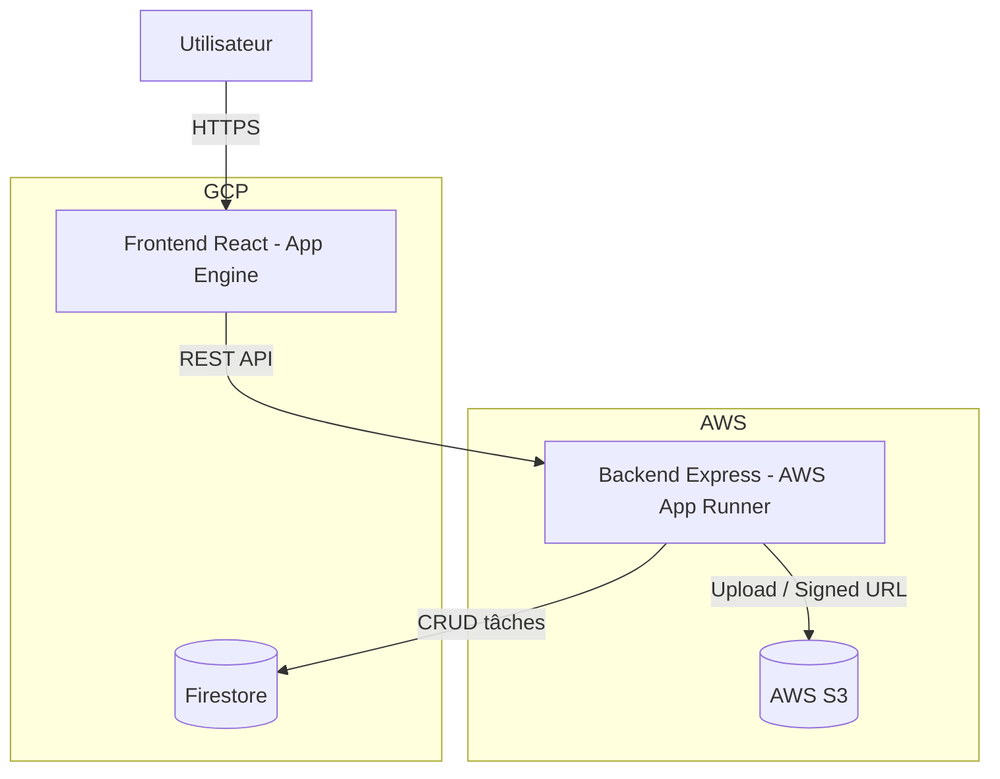

# Projet Cloud Native - Todo Full Stack

Application full-stack conçue pour une soutenance "Développer pour le Cloud".

Architecture retenue:
- Frontend React/Vite servi sur **Google App Engine**.
- Backend Express API déployé sur **AWS App Runner**.
- Base de données managée **Google Firestore**.
- Stockage d'images **AWS S3**.

## 1. Objectif du projet

Démontrer une implémentation cloud-native complète avec:
- architecture distribuée et scalable,
- déploiement multi-cloud,
- pipeline CI/CD automatisée,
- monitoring et observabilité,
- documentation exploitable pour la soutenance.

## 2. Architecture



## 3. Stack et services utilisés

- Frontend: React 19, Vite, Express static server
- Backend: Node.js 20, Express 5
- Base de données: Firebase Admin SDK + Firestore
- Stockage: AWS SDK v3 + S3 (upload et liens signés)
- CI/CD: GitHub Actions
- Monitoring:
  - GCP Cloud Logging/Monitoring pour le frontend
  - AWS CloudWatch Logs/Metrics pour le backend

## 4. Critères module couverts

- **Architecture & conception (/6)**: séparation front/back, services managés Firestore + S3, API stateless.
- **Déploiement cloud (/6)**: front sur App Engine, back sur App Runner.
- **CI/CD (/4)**: tests, builds, push image ECR, déploiements GCP/AWS.
- **Monitoring & observabilité (/2)**: logs structurés backend + dashboards cloud + endpoint `/metrics/basic`.
- **Documentation & présentation (/2)**: README + dossier `docs/` + trame soutenance.

## 5. Démarrage local

### Backend

```bash
cd back
npm ci
cp .env.example .env
npm run dev
```

### Frontend

```bash
cd front
npm ci
cp .env.example .env.local
npm run dev
```

## 6. Variables d'environnement

- `back/.env.example`: Firestore, S3, CORS.
- `front/.env.example`: URL publique du backend.

## 7. CI/CD (GitHub Actions)

Fichier: `.github/workflows/ci-cd.yml`

Pipeline:
1. test backend,
2. test frontend,
3. build image backend,
4. build frontend,
5. déploiement backend AWS (ECR + App Runner),
6. déploiement frontend GCP App Engine.

Secrets GitHub requis:
- `AWS_ACCESS_KEY_ID`
- `AWS_SECRET_ACCESS_KEY`
- `AWS_REGION`
- `AWS_ECR_REPOSITORY`
- `AWS_APPRUNNER_SERVICE_ARN`
- `FRONTEND_API_BASE_URL`
- `GCP_SA_KEY`
- `GCP_PROJECT_ID`

## 8. Déploiement manuel

Les guides détaillés sont dans:
- `docs/deployment.md`
- `docs/monitoring.md`
- `docs/soutenance.md`

## 9. Comptes de test

Utilisez un projet Firebase de test et un bucket S3 de test dédiés.
Ne jamais commiter de clés. Privilégier les secrets CI/CD et IAM roles.
