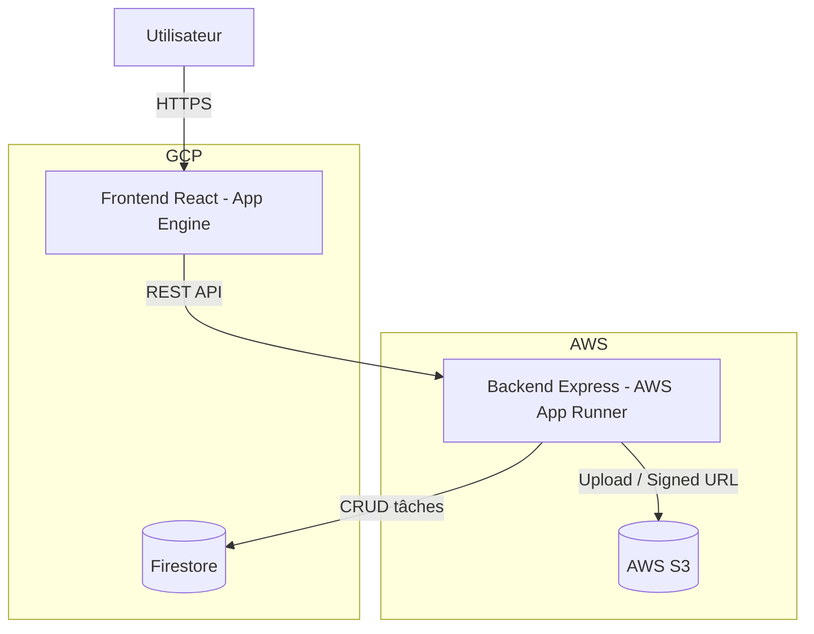

# Projet Cloud Native - Todo Full Stack

Application full-stack réalisée pour la soutenance "Développer pour le Cloud".

## Objectif

Démontrer une implémentation cloud-native complète avec:
- architecture distribuée et scalable,
- déploiement multi-cloud,
- pipeline CI/CD automatisée,
- monitoring et observabilité,
- documentation de déploiement/soutenance.

## Architecture retenue

- Frontend React/Vite: **Google App Engine** (`front`)
- Backend Express API: **AWS App Runner**
- Base de données managée: **Google Firestore**
- Stockage fichiers: **AWS S3**



## Stack technique

- Frontend: React 19, Vite, serveur Express statique
- Backend: Node.js 20, Express 5
- Data: Firebase Admin SDK + Firestore
- Storage: AWS SDK v3 + S3
- CI/CD: GitHub Actions
- Monitoring: CloudWatch (AWS) + Cloud Logging/Monitoring (GCP)

## Exécution locale

Backend:

```bash
cd back
npm ci
cp .env.example .env
npm run dev
```

Frontend:

```bash
cd front
npm ci
cp .env.example .env.local
npm run dev
```

## Variables d'environnement

- `back/.env.example`: Firestore, S3, CORS.
- `front/.env.example`: URL publique du backend.

## CI/CD

Workflow: `.github/workflows/ci-cd.yml`

Pipeline:
1. tests backend,
2. tests frontend,
3. build image backend,
4. build frontend,
5. déploiement backend AWS (ECR + App Runner),
6. déploiement frontend GCP (App Engine).

Secrets GitHub requis (`Repository secrets`):
- `AWS_ACCESS_KEY_ID`
- `AWS_SECRET_ACCESS_KEY`
- `AWS_REGION`
- `AWS_ECR_REPOSITORY`
- `AWS_APPRUNNER_SERVICE_ARN`
- `FRONTEND_API_BASE_URL`
- `GCP_SA_KEY`
- `GCP_PROJECT_ID`

## Validation soutenance (checklist rapide)

- Front public répond.
- Backend App Runner répond sur `/healthz`.
- Le frontend appelle le backend App Runner (vérifiable dans Network `/tasks`).
- Pipeline GitHub Actions verte sur `main`.
- Firestore + S3 utilisés en production.

## Documentation complémentaire

- `docs/architecture.md`
- `docs/deployment.md`
- `docs/monitoring.md`
- `docs/soutenance.md`

## Sécurité

- Ne jamais commiter de clés/credentials.
- Utiliser GitHub Secrets, IAM roles et variables d'environnement.
